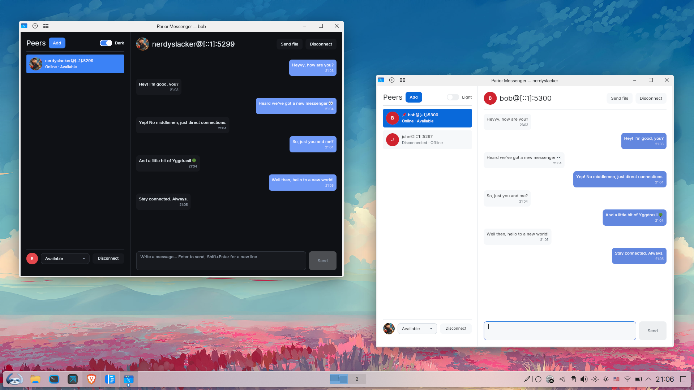

# Parior Messenger

<div align="center">
<a href="https://github.com/nerdyslacker/parior-messenger"></a>
</div>

Desktop GUI client for the Barev protocol, written in Odin with [barev-odin](https://github.com/nerdyslacker/barev-odin) and the [Skald](https://github.com/BuLEEto/Skald) GUI framework.

The current application provides first-run identity setup, persistent contacts, pinned peers and theme settings, local and peer avatars, presence and connection controls, a responsive compact-to-wide interface, a nonblocking network polling loop, peer management, typing indicators, unread counts, desktop notifications, file transfers with progress and cancellation.

<div align="center">

</div>


## Dependencies

Skald and barev-odin are pinned as Git submodules under `vendor/`. Clone this repository recursively:

```sh
git clone --recurse-submodules https://github.com/nerdyslacker/parior-messenger.git
```

For an existing clone, initialize it with:

```sh
git submodule update --init --recursive
```

The repository contains both dependencies at these default paths:

```text
parior-messenger/
  vendor/
    barev-odin/
    skald/
```

The Makefile passes the vendored directories as Odin collection roots. Override either dependency location when necessary:

```sh
make build SKALD_ROOT=/path/to/Skald BAREV_ROOT=/path/to/barev-odin
```

Skald requires SDL3 and a Vulkan loader/driver. See its platform documentation for system setup.

On Linux, desktop notifications use `notify-send`, supplied by the distribution's libnotify command-line tools. Notification delivery is skipped silently when it is unavailable.

## Installation

Build and install Parior system-wide with:

```sh
sudo make install
```

This installs:

```text
/usr/bin/parior
/usr/share/icons/hicolor/256x256/apps/parior.png
/usr/share/applications/parior.desktop
```

The desktop entry registers Parior Messenger with the desktop environment, and the installed icon is available through the standard hicolor icon theme.

By default, `make install` uses `/usr` as the installation prefix. A different prefix can be selected with `PREFIX`:

```sh
make install PREFIX=/usr/local
```

For packaging systems, use `DESTDIR` to stage the installation:

```sh
make DESTDIR="$pkgdir" install
```

The install target builds the optimized release binary automatically. To install to a custom staging directory without requiring root privileges:

```sh
make DESTDIR="$PWD/pkg" install
```

After installation, Parior Messenger can be launched from the application menu or directly with:

```sh
parior
```
Remove a system-wide installation with:

```sh
sudo make uninstall
```

## Commands

```sh
make check
make style
make build
make run
make release
```

Run with default loopback development settings:

```sh
./build/parior
```

Or provide identity and listener settings:

```sh
./build/parior <nick> <bind-ipv6> [port]
```

The defaults are `parior`, `::1`, and Barev's default port. Add peers in the application using `nick@ipv6` or `nick@[ipv6]:port`.

Without command-line overrides, the first launch asks for the local identity before starting Barev. Settings and contacts are stored under the platform user configuration directory in `parior-messenger/`.

## Running multiple test users

Use named profiles and different listener ports to run isolated instances. Each profile has its own identity, contacts, pins, theme, and avatar settings:

```sh
./build/parior --profile alice alice ::1 5299
./build/parior --profile bob bob ::1 5300
```

Then add `bob@[::1]:5300` as a peer in Alice's window and `alice@[::1]:5299` in Bob's window. Profile names are shown in the window titles and stored below `parior-messenger/<profile>/` in the platform configuration directory. `--profile=alice` is also accepted.

Barev peers authenticate by nickname and IPv6 address, so both users must add
each other and the address in each contact must exactly match the other
profile's configured bind address. Saved contacts connect automatically at
startup, and selecting one opens its conversation.

Each concurrently running instance must use a different port. If a configured address or port is unavailable, the application stays open on the setup screen and displays the startup error so the port can be changed.

Use `make build` (or include `-define:ODIN_NBIO_QUEUE_SIZE=128` in a manual
`odin build` command). Odin's larger Linux default io_uring can exhaust the
locked-memory allowance when a second GUI process starts.
